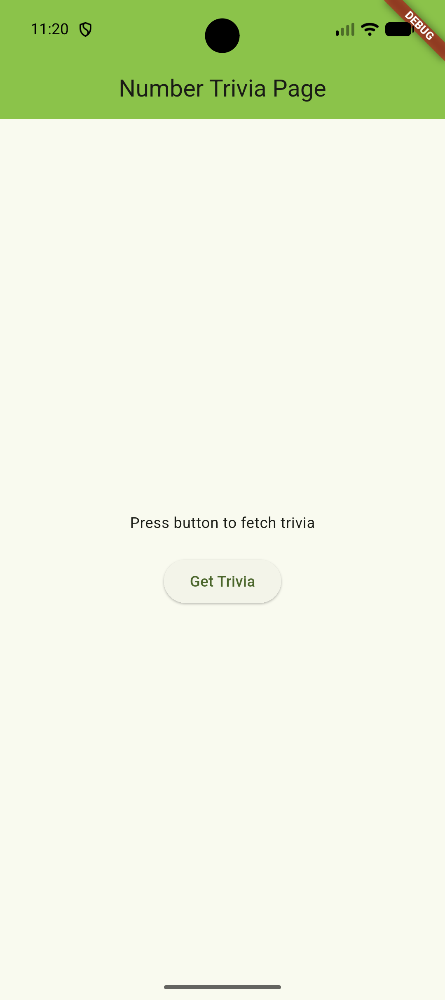
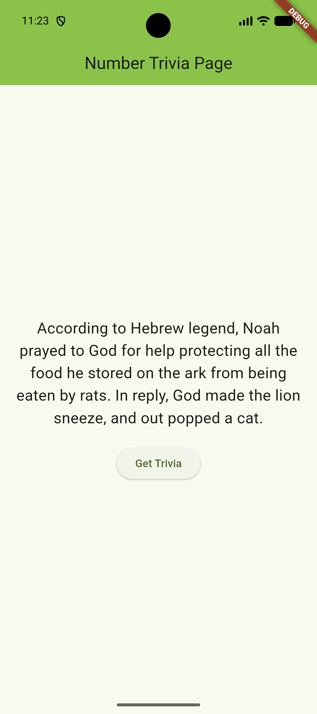

# 🎯 Number Trivia App — Flutter Clean Architecture & TDD

A robust, enterprise-grade Flutter application built following **Clean Architecture** principles and **Test-Driven Development (TDD)**. 

This project demonstrates strict separation of concerns across Domain, Data, and Presentation layers using **BLoC** for state management, **GetIt** for dependency injection, and **Dio** for advanced networking with logging.

---

## 📸 Screenshots

| Home Screen | Trivia Display |
| :---: | :---: |
|  |  |
---

## 📌 Important Note: API Endpoint Change

> **Why Cat Facts instead of Number Trivia?**  
> The original public API endpoint (`numbersapi.com`) frequently experiences server downtime, HTTP cleartext restrictions, and Nginx routing issues. 
> 
> To guarantee **100% network uptime**, **HTTPS security**, and a seamless developer experience, the remote data source was switched to the **Cat Facts API** (`https://catfact.ninja/`).
> 
> **The core architecture remains completely untouched:**
> * Domain Entities, Use Cases, Repositories, BLoCs, and UI Widgets are **100% identical**.
> * The response payload (`fact` text and character `length`) is mapped directly into our `NumberTriviaModel` at the `RemoteDataSource` level.
> * This demonstrates the true power of **Clean Architecture** — swapping an external data source requires zero changes to the core business logic or UI.

---

## 🏗️ Architecture & Layer Breakdown

The project follows Reso Coder's Clean Architecture pattern with three main layers:

```text
lib/
 ├── core/                     # Common utilities, error handling, network clients
 │    ├── error/               # Failures & Exceptions
 │    ├── network/             # DioClient with base URLs & logging
 │    └── usecases/            # Base UseCase contracts
 ├── features/
 │    └── number_trivia/
 │         ├── data/           # Models, Data Sources, Repository Implementations
 │         ├── domain/         # Entities, Use Case contracts, Repository Interfaces
 │         └── presentation/   # BLoCs, Pages, & UI Widgets
 └── injection_container.dart  # GetIt Dependency Injection container

```
---

## 🛠️ Tech Stack & Dependencies

Framework: Flutter

State Management: flutter_bloc

Dependency Injection: get_it

Networking: dio

Functional Error Handling: fpdart / dartz

Testing: bloc_test, mocktail
